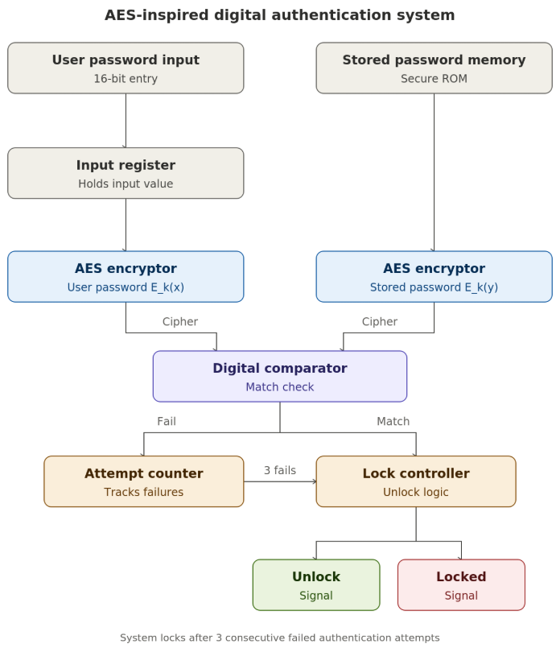
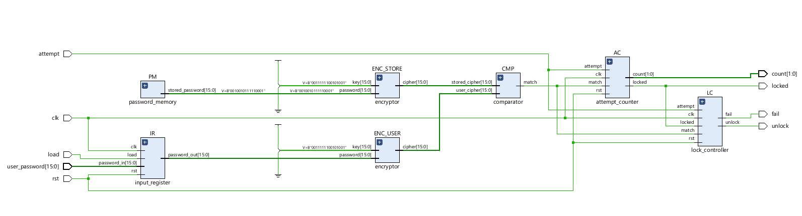
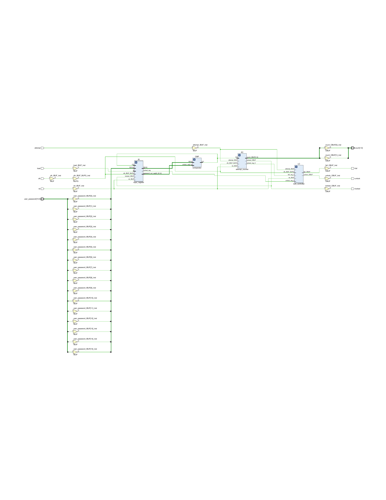
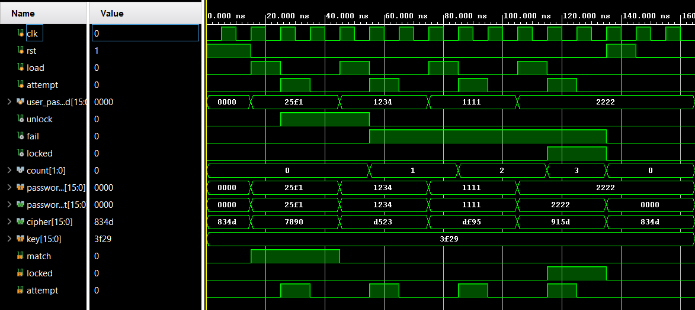

# AES-Inspired Digital Authentication System

A hardware based digital authentication system implemented in **Verilog HDL** using an **AES inspired encryption algorithm**. The design encrypts both the user entered password and the stored password before comparison, improving security over plain text authentication. An integrated attempt counter and lock controller enhance security by locking the system after multiple failed login attempts.

---

## 📖 Overview

This project demonstrates the implementation of a secure authentication system for FPGA platforms. Instead of directly comparing passwords, both the user-entered password and the stored password are processed through identical AES-inspired encryption modules. The encrypted outputs are then compared to determine whether authentication is successful.

The project was designed, simulated, and synthesized using **Xilinx Vivado 2025.1**.

---

## ✨ Features

- AES inspired password encryption
- Hardware based password authentication
- Modular Verilog HDL design
- Secure encrypted password comparison
- Three attempt security lock mechanism
- FPGA ready implementation
- Behavioral simulation and synthesis in Vivado

---

## 🏗️ System Architecture



---

## ⚙️ How it works

1. The user enters a password.
2. The password is stored in the **Input Register**.
3. The stored password is retrieved from **Password Memory**.
4. Both passwords are encrypted independently using identical Encryptor modules.
5. The encrypted outputs are compared using the Comparator.
6. If both encrypted values match, an **Unlock** signal is generated.
7. If authentication fails, the Attempt Counter increments.
8. After three consecutive failed attempts, the Lock Controller permanently locks the system until reset.

---

## 🧩 Project Structure

```text
AES-Inspired-Digital-Authentication-System/
│
├── src/
│   ├── top.v
│   ├── attempt_counter.v
│   ├── comparator.v
│   ├── encryptor.v
│   ├── input_register.v
│   ├── key_mixer.v
│   ├── lock_controller.v
│   ├── password_memory.v
│   ├── permute.v
│   ├── sbox4.v
│   └── substitute.v
│
├── testbench/
│   └── top_tb.v
│
├── constraints/
│   └── boolean_board.xdc
│
├── images/
│   ├── architecture_diagram.png
│   ├── rtl_schematic.png
│   ├── synthesized_design.png
│   └── simulation_waveform.png
│
├── README.md
├── LICENSE
└── .gitignore
```

---

## 📦 Modules

| Module | Description |
|--------|-------------|
| **Top Module** | Integrates all functional modules. |
| **Input Register** | Stores the user-entered password. |
| **Password Memory** | Stores the reference password. |
| **Encryptor (ENC_USER)** | Encrypts the user password. |
| **Encryptor (ENC_STORE)** | Encrypts the stored password. |
| **Comparator** | Compares encrypted passwords. |
| **Attempt Counter** | Counts consecutive failed login attempts. |
| **Lock Controller** | Controls Unlock and Locked outputs. |

---

## 🖥️ RTL Schematic



The RTL schematic represents the hierarchical hardware design generated from the Verilog modules before synthesis.

---

## 🔬 Synthesized Design



The synthesized design illustrates the optimized hardware implementation generated by Vivado after synthesis.

---

## 📈 Simulation Results



Simulation verifies:

- Successful authentication for valid credentials
- Failed authentication for incorrect passwords
- Correct comparator operation
- Attempt counter functionality
- Lock activation after three failed attempts
- Unlock signal generation for valid authentication

---

## 🛠️ Tools Used

- Xilinx Vivado 2025.1
- Boolean FPGA Board 

---

## 📄 License

This project is licensed under the [MIT License](LICENSE).

---

## 👨‍💻 Author

**Sparsh Malhotra**